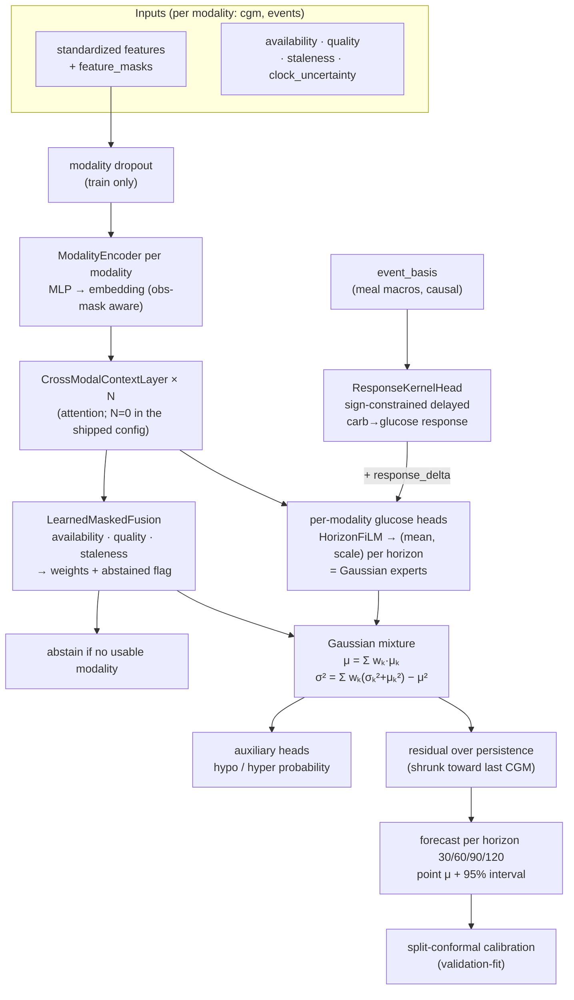

# NeuroGlycemicNet — model architecture (as built)

This diagram is generated from the actual code
(`neuroglycemic-sentinel/src/neuroglycemic/neural_model.py::NeuroGlycemicNet.forward`), not
an idealization. It is an **availability-aware mixture-of-experts** with a physiological
meal-response kernel and probabilistic (Gaussian) heads, trained as a **residual over
persistence**. A rendered image is at `outputs/_r2/model_architecture.png`.

## Block-by-block (what each piece does and why)

| Block | Code | Role |
|---|---|---|
| **Modality encoders** | `ModalityEncoder` | One small MLP per modality (cgm, events) → a shared-dim embedding; consumes the observation mask so missing features are *known-absent*, not zero-imputed. |
| **Cross-modal context** | `CrossModalContextLayer` | Optional attention across modality embeddings. `cross_modal_layers=0` in the shipped config (the ladder showed extra capacity isn't warranted). |
| **Gaussian experts** | `HorizonFilmHead` | Per-modality, per-horizon `(mean, scale)` via horizon-conditioned FiLM — each modality is a probabilistic expert, not a point estimate. |
| **Response kernel** | `ResponseKernelHead` | A **sign-constrained** basis for the delayed carb→glucose response; adds a physiologically-shaped `response_delta` to the expert means (meals *raise* future glucose, bounded gain). |
| **Learned masked fusion** | `LearnedMaskedFusion` | Weights the experts by **availability + quality + staleness + clock uncertainty**; emits an `abstained` flag when no modality is usable — the availability-aware honesty gate. |
| **Gaussian mixture** | `forward` L660–664 | Combines experts into one calibrated `μ, σ²` per horizon (proper mixture moments, not an ad-hoc average). |
| **Residual over persistence** | `model.py` wrapper | The network predicts a **correction to persistence** (last CGM), shrunk toward it — the inductive bias that makes it reliably beat the persistence baseline. |
| **Calibration** | `calibration.py` | Split-conformal, validation-fit, applied at eval → the ~0.91 PI-95 coverage reported honestly. |
| **Auxiliary heads** | `forward` L667 | Hypo/hyper-glycemia probabilities from the fused embedding (masked to NaN on abstention). |

## Why this shape (see `docs/MODEL_JUSTIFICATION.md`)

The mixture-of-experts + fusion + response-kernel machinery is what lets the model **abstain,
calibrate, and fuse modalities** — capabilities a plain regressor lacks. On raw point RMSE the
model ladder shows gradient boosting is equal-or-better, so the deep model is justified by
*those capabilities*, not by point accuracy — and that trade-off is reported, not hidden.
