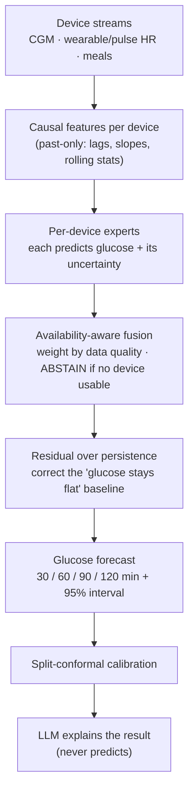

# Model flow (simple)

The glucose forecaster at a glance — device streams in, calibrated forecast out, LLM
explains. (For the detailed internals see `docs/MODEL_ARCHITECTURE.md`; for the whole
system see `docs/FRAMEWORK_OVERVIEW.md`.)



**How to read it**

1. **Device streams** — whatever the DVXR devices provide: the CGM, the wearable/pulse
   watch (HR/HRV), and logged meals. (EEG plugs in here too once co-registered EEG+CGM data
   is collected.)
2. **Causal features** — each stream becomes past-only features (no future leakage).
3. **Per-device experts** — each device gets its own expert that outputs a glucose estimate
   *and* an uncertainty; a device the model trusts less contributes less.
4. **Availability-aware fusion** — experts are weighted by current data quality/staleness;
   if no device is usable the model **abstains** instead of guessing.
5. **Residual over persistence** — the network corrects the naive "glucose stays flat"
   baseline, which is why it reliably beats it (RMSE ~13 vs 17.4 mg/dL @30 min).
6. **Calibration + LLM** — a conformal interval makes the uncertainty honest; the LLM turns
   the numbers into a readable explanation without inventing any value.
```
